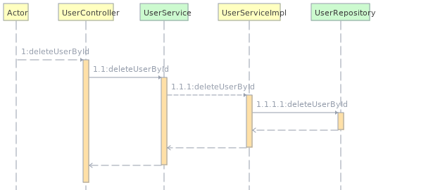

# Nisum
Examen Practico

---


### Pre-requisitos

* Java 11 (JDK)
* Gradle
* Git

## Instalacion

---


##### Instalar Lombok en el IDE

_Esto depende del IDE(1) que utilices, seguir indicaciones de la web de [Project Lombok](https://projectlombok.org/)


##### Ejecutar tests para ver que esta todo en orden

    gradle test

##### Iniciar aplicacion

    gradlew bootRun

## URLs

---

* [Crear un usuario](http://localhost:8080/user/create) Realiza el alta del usuario y entrega los datos juntos con el token.
```json
{
  "name": "Juan Rodriguez",
  "email": "juan@rodriguez.org",
  "password": "hunter2!",
  "phones":
  [
    {
      "number": "1234567",
      "citycode": "1",
      "contrycode": "57"
    }
  ]
}
```

* [Autenticar un usuario creado con usuario y contraseña](http://localhost:8080/user/authenticate) Utiliza el mail y contraseña del usuario para aautenticarlo y renovar el token.
```json
{
  "username": "juan@rodriguez.org",
  "password": "hunter2!"
}
```


* [Obtener todos los usuarios creados](http://localhost:8080/user/find-all) Obtiene todos los usuarios creados y utiliza JWT como metodo de autorizacion (Bearer Token).
* [Obtener un usuario utilizando UID](http://localhost:8080/user/{id}) Obtiene un usuario a partir de un UID y utiliza JWT como metodo de autorizacion (Bearer Token).
* [Borrar un usuario utilizando el UID](http://localhost:8080/user/delete/{id}) Borra un usuario a partir de un UID y utiliza JWT como metodo de autorizacion (Bearer Token).

## Swagger

 ---


* [Documentación en Swagger](http://localhost:8080/swagger-ui/index.html) listado de los servicios expuestos.
## Diagramas


---

##### Diagrama de solución

##### Crear un usuario

##### Autenticar un usuario creado con usuario y contraseña

##### Borrar un usuario utilizando el UID

##### Obtener todos los usuarios creados

##### Obtener un usuario utilizando UID


## Construido con:

---

Herramientas
* [Spring boot](https://spring.io/projects/spring-boot) - Framework de java
* [Spring data rest](https://spring.io/projects/spring-data-rest) - Biblioteca para generar una API REST a partir de una @Entity
* [Json Web Token](https://jwt.io/introduction) Herramienta para segurizar la comunicacion entre cliente/servidor
* [Lombok](https://projectlombok.org/) Libreria para evitar el codigo repetitivo
* [h2database](https://www.h2database.com/html/main.html) Base de datos en memoria


## Notas

---

(1) Se recomienda [IntelliJ Community](https://www.jetbrains.com/idea/download/) o [Eclipse IDE for Enterprise Java Developers](https://www.eclipse.org/downloads/packages/)****
